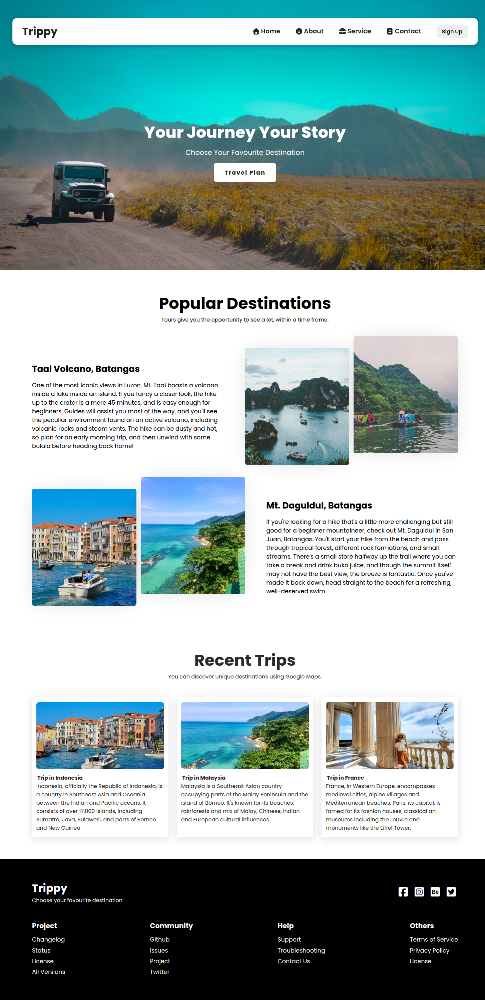

# 🌍 Trippy - Travel Agency SPA


A fully responsive, modern Single Page Application (SPA) built for a fictional travel agency. This project demonstrates modern frontend architecture, dynamic data rendering, and advanced CSS layouts.

**[🔴 Live Demo: Click Here to View on Vercel](https://react-tour-travel-app.vercel.app)** ---

## 📸 Project Preview


---

## ✨ Key Features
* **Modern SPA Routing:** Seamless page transitions without reloading, powered by `react-router-dom`.
* **Dynamic Component Architecture:** Built with reusable, data-driven React components to adhere to the DRY (Don't Repeat Yourself) principle.
* **Fully Responsive Design:** Custom media queries ensure perfect layouts across mobile, tablet, and desktop screens.
* **Interactive Mobile Navigation:** Features a custom-built, animated hamburger menu for smaller viewports.
* **Custom Sign-Up Flow:** Includes a fully controlled React form with active state management for new user registration.

---

## 🛠️ Tech Stack
* **Framework:** React.js (Bootstrapped with Vite for maximum performance)
* **Routing:** React Router DOM (v6)
* **Styling:** Pure CSS3 (Flexbox, Grid, Custom Variables, Advanced Selectors)
* **Icons:** FontAwesome

---

## 🧠 Technical Highlights & Learnings
While building this project, I focused heavily on mastering modern React and CSS fundamentals:
1. **Prop Drilling & Dynamic Rendering:** Created master template components (like `DestinationData` and `TripData`) that accept unique props, allowing complex UI sections to be generated dynamically from clean data arrays.
2. **Advanced CSS Positioning:** Utilized `position: absolute` and `transform: translate(-50%, -50%)` to perfectly center dynamic text overlays on top of responsive viewport-height images.
3. **Controlled Forms:** Implemented stateful inputs inside the custom `/signup` route to actively manage and capture user data.
4. **CSS Grid & Flexbox:** Architected complex side-by-side layouts and responsive image galleries without relying on external libraries like Bootstrap or Tailwind.

---

## 💻 Local Setup Instructions

Want to run this project locally? Follow these steps:

1. **Clone the repository:**
   ```bash
   git clone [https://github.com/umersaif11/react-tour-travel-app.git](https://github.com/umersaif11/react-tour-travel-app.git)
   ```

2. Navigate to the project directory
```bash
   cd react-tour-travel-app.git
```    
3. Start the development server
```bash
   npm run dev
```  
   